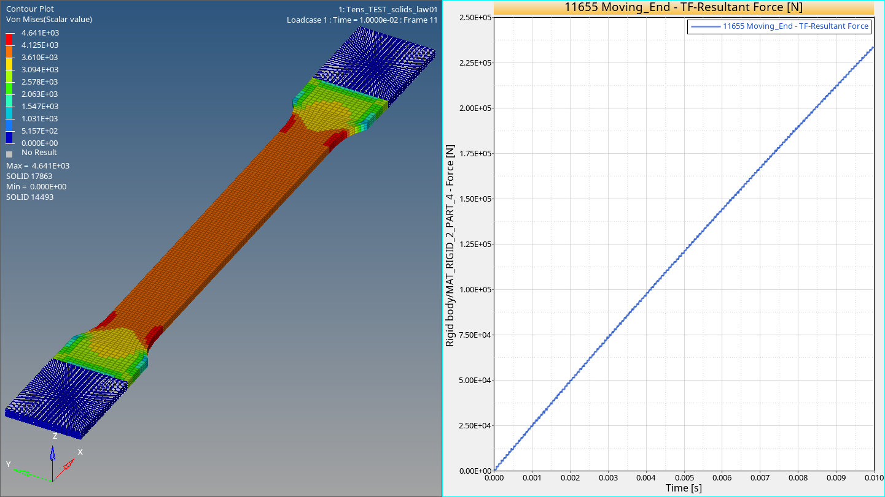

# Purpose and Results

/MAT/LAW1: Elastic Material Law using the Hook's law Model - Solids (Hexa) elements

This is the most basic material model: Hooke's law
It exists in any solver and represents the starting poing of any nonlinear model.

Should be used with care in nonlinear applications, since large deformation can lead to very high stresses, 
where material behavior can become unstable.
In case of doubt, use an elasto-plastic material law, like LAW2 (Johnson-Cook model).

Application is for parts, which do NOT undergo large stresses and strains/deformations. 
Only acting as "kinetic energy container".

<figcaption align = "center"><b>Figure 1. (left) Von Mises stress (right) Force [kN] vs. Time plot /MAT/LAW1</b></figcaption>
