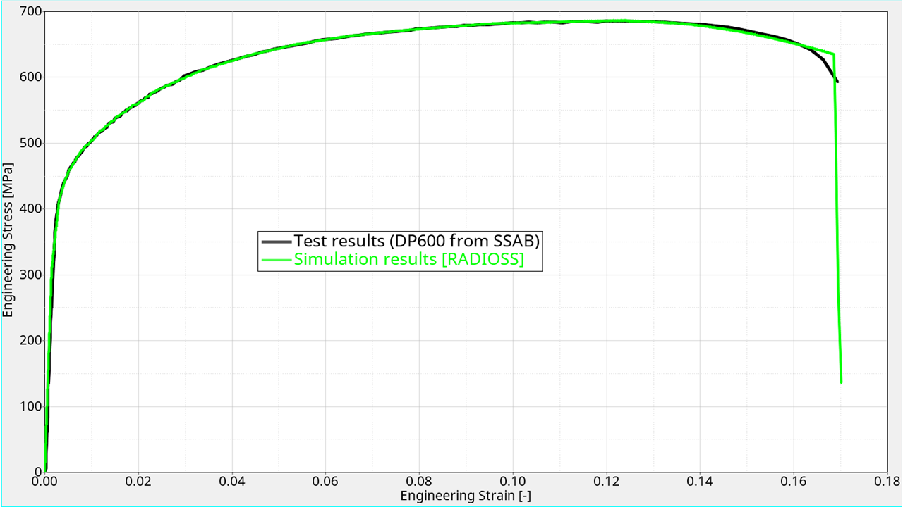

# Results

/MAT/LAW36: Elasto-plastic Material Law using piecewise linear plasticity defined by a true-stress vs. true-plastic-strain curve (/FUNCT/)

The material card was created based on real data provided by SSAB (www.ssab.com) in 2008. It represents the DOCOL 600DP steel.
In addition to the failure and softening parameter in this material law, an additional failure criterion is used: /FAIL/BIQUAD

The purpose of this model is to demonstrate the accuracy of OpenRadioss until the necking point and possiblities to model the softening and failure behavior.

<figcaption align = "center"><b>Figure 1. Shows the mesh, mesh-size and overall FE model.</b></figcaption>

<figcaption align = "center"><b>Figure 2. Shows the model set-up compared to reality.</b></figcaption>

After performing the OpenRadioss simuilation, the resultant Stress vs. Strain curve is overlayed vs. the curve obtained by the real test.

<figcaption align = "center"><b>Figure 3. Shows the Resultant Engineering stress vs. strain curve, compared to the measure in the real test.</b></figcaption>

Two different runs were provided, using OpenRadioss and the same model. Only with the modification of the damage and failure model.

<figcaption align = "center"><b>Figure 4. Shows the results in fracture compared to reality.</b></figcaption>

