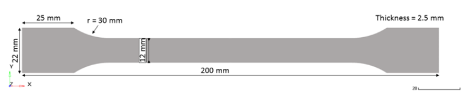
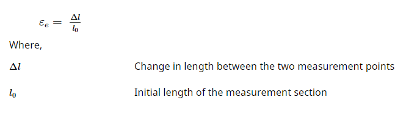
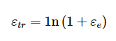
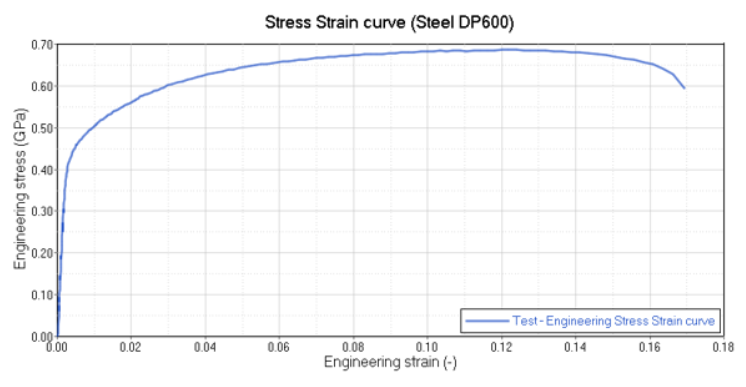
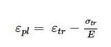
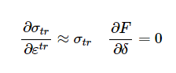
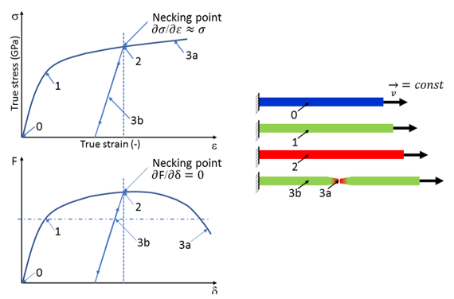

# Introduction

The purpose of this example is to introduce a method for characterizing and validation of the most commonly used OpenRadioss material laws for modeling elasto-plastic materials.

The use of "engineering” and "true” stress-strain curves is pointed out. Failure models are also introduced to better fit the experimental response.

# Options and Keywords Used

Keyword documentation may be found in the reference guide available from

OpenRadioss User Documentation

   * Shell elements

   * Isotropic elasto-plastic Johnson-Cook material (/MAT/LAW2 (PLAS_JOHNS))

   * Isotropic elasto-plastic material (/MAT/LAW36 (PLAS_TAB))

   * Necking point, maximum stress, and failure criteria

   * Boundary conditions (/BCS)

   * Imposed velocities (/IMPVEL)

   * Material definition (Materials)

   * Moving Frame (/FRAME/MOV)

   * Nodal time step (/DT/NODA/CST)

   * H3D animation output (H3D Output)

   * Experimental results (Steel DP600) (See Reference 1)

# Model Description

Tension is applied to an object. The standardized “dogbone" object contains a defined cross-sectional area A0, The material to be characterized is DP600 Steel. (Ref. 1) A velocity is imposed at the right-end.

Units: mm, ms, kg, N, GPa.

<figcaption align = "center"><b>Figure 1. Geometry of the Standardized Tensile Object With a Defined Cross Sectional Area</b></figcaption>
 

The material undergoes isotropic elasto-plastic behavior which can be reproduced by a Johnson-Cook (/MAT/LAW2). The tabulated material law (/MAT/LAW36) is also studied.

The model is meshed with 4-node shells and 3-node shells as shown in Figure 2. The average element size is about 2 mm.

The shell properties use recommended best practice settings, except for the thickness which matches the test.

   * 5 integration points over the thickness.

   * QEPH shell formulation (Ishell = 24).

   * Iterative plasticity for plane stress (Newton-Raphson method; Iplas = 1).

   * Thickness changes are considered in stress computation (Ithick = 1).

   * Initial thickness is uniform, equal to 2.5 mm

# Boundary Conditions

The left side of the object is fixed in all six degrees of freedom (all three translational and all three rotational DOFs). On the right side only translation in X-direction is free, all other five DOFs are fixed. An imposed velocity of -1.0 m/s in the X-direction is applied to the main node of the rigid body, shown Figure 2, whereby the elongation is increased uniformly at low speed.

<figcaption align = "center"><b>Figure 2. All Boundary Conditions Applied to the Tensile Model</b></figcaption>

Two measurement nodes with a distance of 80 mm are chosen (Figure 3) to continuously measure the change in length Δl in the measurement section of the sample during the simulation and to obtain the strain εe on the sample. 

The engineering (nominal) stress is calculated as: (Equation 1)

&nbsp;

The total engineering strain is calculated as: (Equation 2)

&nbsp;

<figcaption align = "center"><b>Figure 3. Measurement Nodes with an initial Distance of 80mm</b></figcaption>

&nbsp;

The true strain is computed with the relationship: (Equation 3)

Engineering strain and true strain; therefore, are linked together by: (Equation 4)

True stresses are measured by dividing the force with the true deformed section: (Equation 5)

Thus, to compute true stresses, the area variation must be considered. If Poisson’s coefficient is 0.5 during plastic deformation, the true area in mono-axial traction is: (Equation 6)

Thus, the relationship between true and engineering stresses is: (Equation 7)

&nbsp;

<figcaption align = "center"><b>Figure 4. Experimental Results of a Tensile Test of a DP600 Steel Object</b></figcaption>

# Characterization of the Material Law

There are two steps to characterize the material law.

Transform the engineering stress versus engineering strain curve into a true stress versus true strain curve (this step applies to any elasto-plastic material law).

Extract the main parameters from the true stress versus true strain curve, to define the material law (Johnson-Cook law and material coefficients for /MAT/LAW2 or the yield curve definition for /MAT/LAW36).

When there is no material test data available (for example, in an early design stage), values of Yield stress, Ultimate tensile strength (engineering stress value) and Engineering strain at UTS must be provided to characterize /MAT/LAW2 using Iflag = 1.

The characterization will be made for /MAT/LAW2 (Johnson-Cook elasto-plastic), and /MAT/LAW36 (tabulated elasto-plastic). For each of the material laws, the yield stress and Young's modulus are determined from the curve.

The plastic strain can be defined as: (Equation 8)

An important point to be characterized on the curve is the necking point, where the slope of the force versus the displacement curve is equal to 0, and where the following relationships apply: (Equation 9)

&nbsp;

<figcaption align = "center"><b>Figure 5. Tensile Test Schematic (0 - 1= elastic region; 1= yield point; 2= necking point; 3a= fracture; 3b= linear elastic relaxation)</b></figcaption>

&nbsp;

 **Table 1. Equations Used for Analysis**

| Material Property  | Generic Equation   |
| ------------------ | ------------------ |
| Engineering stress |  |
| Engineering strain |  |
| True stress        |  |
| True strain        |  |
| True strain rate   |  |

 
# Results

* [/MAT/LAW2: Elasto-plastic Material Law using the Johnson-Cook Model](Law002/README.md)

/MAT/LAW36: Elasto-plastic Material Law using a Tabulated Input Function

Since tensile test data is available, a more accurate method is to use that data in material LAW36. The first step is to take the test data and calculate the true stress versus true plastic strain curve by using Equation 4 and Equation 7.
Figure 7. Engineering Stress versus Strain Compared to True Stress-Strain, Experimental Data

The necking point is where the slope of the engineering stress-strain curve becomes zero. All values after the necking point can not be used for creating the material curve for /MAT/LAW36 and can be removed from the data and disregarded. Values after the necking point must be extrapolated to a strain larger than failure for the material. The necking point occurs at the engineering strain at the ultimate tensile stress = 0.129. After this point, the curve was linearly extrapolated to 100% plastic strain as shown in Figure 8.

Next, the true stress versus true plastic strain is calculated using Equation 8.
Figure 8. True Stress versus True Plastic Strain Curve Extrapolated to 100%

Using the curve in Figure 8 as input in LAW36, the simulation results perfectly match the test curve between yield point and the necking point, as shown in Figure 9. The post necking behavior depends on the method used to extrapolate the true stress versus true plastic strain data after necking.
Figure 9. Comparison of the Simulation Results of the Tensile Test with /MAT/LAW36 versus Test
/FAIL/BIQUAD: Simplified Nonlinear Strain-based Failure Criteria with Linear Damage Accumulation

In some elasto-plastic material models, a single plastic strain at failure can be input to model material failure. The element is deleted when the plastic strain reaches a user-defined value εp_max 

The main disadvantage of using this approach is the element is deleted when the plastic strain is reached no matter the stress state. There is no difference between failure in tension or compression. Metals usually show different strains at failure for the different states of stress. Especially in the case of compression, the failure strain is usually much higher than for tension. To overcome this limitation, /FAIL/BIQUAD is used instead of the simple maximum equivalent plastic strain that can be defined in the material input. With a few simple inputs, /FAIL/BIQUAD creates a nonlinear plastic strain at failure as a function of stress triaxality.
/MAT/LAW2 with /FAIL/BIQUAD

When the default high strength steel (HSS) values (M_flag =2) included in /FAIL/BIQUAD are used, the simulation shows failure before the test. To better match the test, the /FAIL/BIQUAD uniaxial tension plastic strain at failure value (c3) is increased from 0.5 to 0.75. Figure 10 shows the results for both simulation cases.
Figure 10. Comparison of Simulation Results of Tensile Test: /MAT/LAW2 with /FAIL/BIQUAD versus Test
/MAT/LAW36 with /FAIL/BIQUAD

Similar to the LAW2 simulation, the /FAIL/BIQUAD uniaxial tension plastic strain at failure value (c3) is increased from 0.5 to 0.9 so that the failure point in the simulation matches the test.
Figure 11. Comparison of Simulation Results of Tensile Test: /MAT/LAW36 with /FAIL/BIQUAD versus Test
Conclusion

In the first part of the example, a method was introduced to characterize and validate the most commonly used OpenRadioss material laws. The /MAT/LAW2 (PLAS_JOHNS) material was used with a few material parameters to represent the material. The /MAT/LAW36 (PLAS_TAB) material was used with experimental data of a tensile test for a more accurate simulation. The use of "engineering” and "true” stress-strain curves was pointed out.

To describe the failure behavior in tension and compression a simplified nonlinear strain-based failure criterion with linear damage accumulation (/FAIL/BIQUAD) was used to better fit the experimental response.
References

1: SSAB  – a stronger, lighter, and more sustainable world

