# Introduction

This Section links to the example Models and HPC Benchmarks.
These examples are in the OpenRadioss confluence page

## List of models

### HPC Benchmarks

HPC Benchmark models can be found on  [OpenRadioss.org / HPC Model page](https://openradioss.atlassian.net/wiki/spaces/OPENRADIOSS/pages/47546369/HPC+Benchmark+Models) to download HPC Benchmark Models

| HPC Benchmark models             |                                                                                                                                |
| -------------------------------- | ------------------------------------------------------------------------------------------------------------------------------ |
| 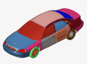     | [Ford Taurus 10 million element HPC Benchmark](https://openradioss.atlassian.net/wiki/spaces/OPENRADIOSS/pages/47546369/HPC+Benchmark+Models#Taurus-10-Million-finite-elements) |
| 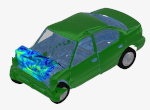         | [Chrysler Neon 1 million element HPC Benchmark](https://openradioss.atlassian.net/wiki/spaces/OPENRADIOSS/pages/47546369/HPC+Benchmark+Models#1M-Element-Neon-model) |

### Example Models

Example models can be found on [OpenRadioss.org / Examples page](https://openradioss.atlassian.net/wiki/spaces/OPENRADIOSS/pages/8749071/Example+Models)

#### OpenRadioss Block Format

| Example models                   |                                                                                                                                |
| -------------------------------- | ------------------------------------------------------------------------------------------------------------------------------ |
|   | [Bird Strike On Windshield](https://openradioss.atlassian.net/wiki/spaces/OPENRADIOSS/pages/8847361/Bird+Strike+On+Windshield) |
| 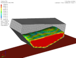   | [INIVOL and Fluid Structure Interaction (Drop Container)](https://openradioss.atlassian.net/wiki/spaces/OPENRADIOSS/pages/9338881/INIVOL+and+Fluid+Structure+Interaction+Drop+Container) |
| 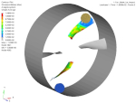 | [Fan Blade Rotation Initialization and Impact](https://openradioss.atlassian.net/wiki/spaces/OPENRADIOSS/pages/9207839/Fan+Blade+Rotation+Initialization+and+Impact) |
| 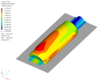   | [Blow Molding with AMS](https://openradioss.atlassian.net/wiki/spaces/OPENRADIOSS/pages/9011303/Blow+Molding+with+AMS) |
| 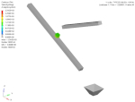     | [Ice Cube](https://openradioss.atlassian.net/wiki/spaces/OPENRADIOSS/pages/9437194/Ice+Cube)  |
|   | [Spring Back](https://openradioss.atlassian.net/wiki/spaces/OPENRADIOSS/pages/9502721/Spring-back) |
| 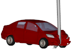  | [Yaris Impact on Pole at 40km/h](https://openradioss.atlassian.net/wiki/spaces/OPENRADIOSS/pages/10518529/Yaris+impact+on+pole+at+40km+h) |
| 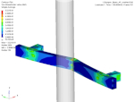  | [Bumper Beam](https://openradioss.atlassian.net/wiki/spaces/OPENRADIOSS/pages/11075585/Bumper+Beam)  |
| 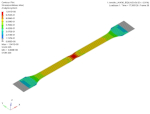 | [Tensile Test](https://openradioss.atlassian.net/wiki/spaces/OPENRADIOSS/pages/11075620/Tensile+Test) |
|  | [Tensile Test Example Tutorial Using Gmsh](https://openradioss.atlassian.net/wiki/spaces/OPENRADIOSS/pages/24444938/Tensile+Test+Example+Tutorial+Using+Gmsh)  |
| 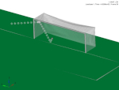    | [Football (Soccer) Shots](https://openradioss.atlassian.net/wiki/spaces/OPENRADIOSS/pages/11141121/Football+Soccer+Shots) |
| 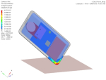   | [Cell Phone Drop Test](https://openradioss.atlassian.net/wiki/spaces/OPENRADIOSS/pages/11141156/Cell+Phone+Drop+Test) |
|         | [Rubber 'O-Ring' Seal Installation](https://openradioss.atlassian.net/wiki/spaces/OPENRADIOSS/pages/11173889/Rubber+O-Ring+Seal+Installation) |

#### LS-DYNA® key format

| LS-DYNA® key format              |                                                                                                                                |
| -------------------------------- | ------------------------------------------------------------------------------------------------------------------------------ |
| 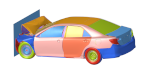      | [Camry Impact Model in LS-DYNA® format](https://openradioss.atlassian.net/wiki/spaces/OPENRADIOSS/pages/10518559/Camry+Impact+Model+in+LS-DYNA+format) |
| 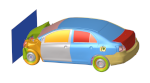      | [Yaris Impact Model in LS-DYNA® format](https://openradioss.atlassian.net/wiki/spaces/OPENRADIOSS/pages/30539777/Yaris+Impact+Model+in+LS-DYNA+format) |
|  | [Tensile Test Model in LS-DYNA® format](https://openradioss.atlassian.net/wiki/spaces/OPENRADIOSS/pages/21364914/Tensile+Test+Model+in+LS-DYNA+format) |
