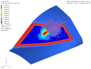
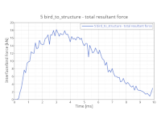

# Model Title

## Model Description

* Explain what the model does and the main options.
* Any helpful information to help understanding the model.
* A picture of the model can be helpful. Place the picture in specific directory

Example :

## Options and Keywords Used

Brief list of main Options used :

* Elements
* Contact interfaces
* Materials
* ...

## Results

* Show the results
* You may add pictures to illustrate the results: time history curves, amination,...

  
